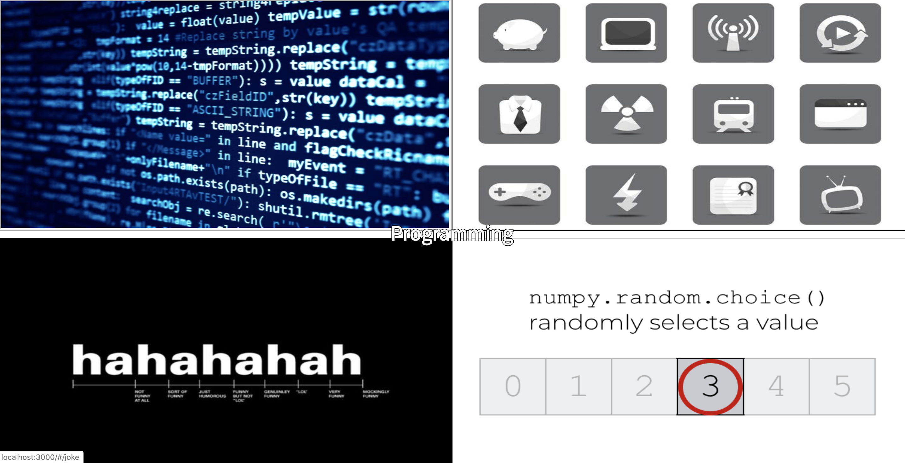
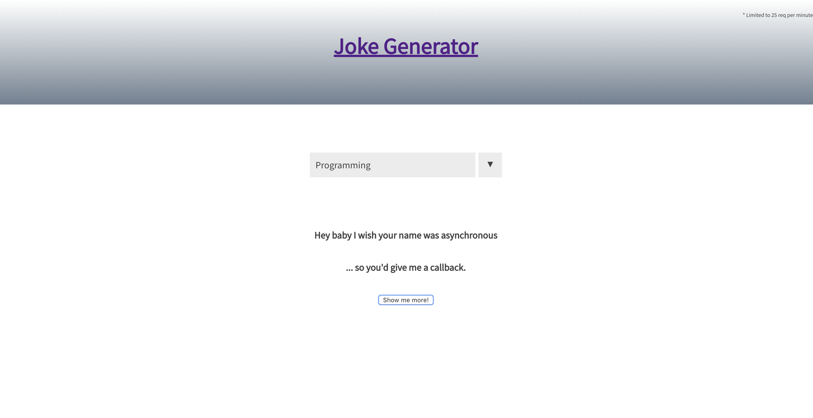

# Joke Generator

The Joke Generator is a small application that generates a random joke. The user may select one of four categories at a time: Programming, Misc, Dark Humor, or Random. Although this is a small application I chose to implement Redux to familiarize myself with the technology. This app is a React frontend and Node backend using an Express server. 

## Built With

* JavaScript
* HTML/CSS
* React
* Redux
* Node
* Express

## Pages

### Front Page

User can select a category to start with.

### Prompts

The user can generate more jokes and change the category.

* JokeAPI has frequent maintenance which may affect experience.

https://chaselipscomb.github.io/Password/